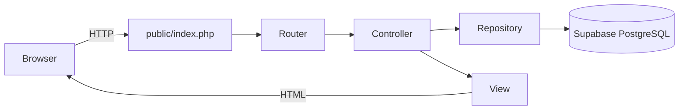
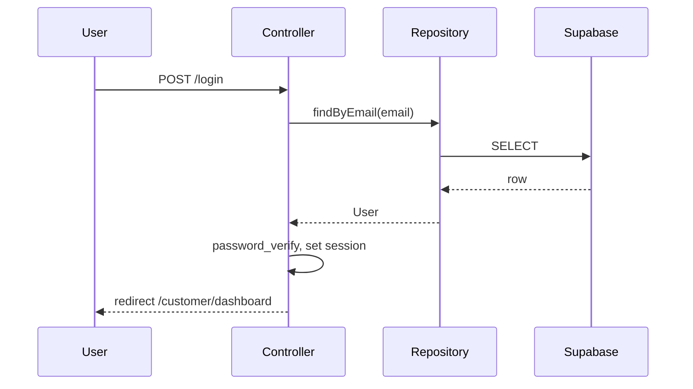

# Bank Management App: Learn PHP, MVC, and Supabase (From Scratch)

## Your goal

Build a **simple banking app yourself** as a learning project. You will not copy HTML or code from [alnahian2003/bangubank](https://github.com/alnahian2003/bangubank)—that repo is only a **reference** for what features the assignment expects.

Your stack:

- **Plain PHP** (no Laravel)
- **OOP + Namespaces + Composer autoload**
- **Sessions** for logged-in users
- **MVC folder structure** you design and understand
- **Supabase** (PostgreSQL) for storage

Local workspace today: a small practice [`index.php`](index.php) with loops/arrays—a good starting point for PHP basics.

---

## Part 1 — Learn PHP concepts first (before the full app)

Work through each topic with a **small standalone script** in a `learning/` folder (optional). Delete or ignore these once you understand them.

### Step 1: Basics

| Concept | Banking use |
|---------|-------------|
| Variables, strings, floats | Amounts, balances |
| Indexed & associative arrays | Lists of transactions |
| `if`, `foreach` | Validation, rendering rows |
| `$_GET`, `$_POST` | Login, register, transfer forms |

### Step 2: Functions

```php
function isValidAmount(mixed $amount): bool {
    return is_numeric($amount) && (float) $amount > 0;
}
```

### Step 3: OOP (core of your project)

```php
namespace App\Models;

class User {
    public function __construct(
        public readonly int $id,
        public string $name,
        public string $email,
        public string $role,
        public float $balance
    ) {}
}
```

| Concept | Where you use it |
|---------|------------------|
| Class | `User`, `Transaction`, `Database` |
| Object | One customer loaded from DB |
| Properties | `email`, `balance`, `role` |
| Methods | `deposit()`, `findByEmail()` |
| Constructor | Map DB row → object |
| Encapsulation | SQL hidden in `Repository` classes |

### Step 4: Namespaces + Composer

- One class per file
- Namespace matches folder: `App\Controllers\AuthController` → `app/Controllers/AuthController.php`
- `composer.json` PSR-4 autoload:

```json
{
  "autoload": {
    "psr-4": {
      "App\\": "app/"
    }
  }
}
```

Run `composer dump-autoload` after adding classes.

### Step 5: Sessions

```php
session_start();
$_SESSION['user_id'] = $user->id;
$_SESSION['role'] = $user->role; // 'admin' or 'customer'
```

- Login → set session
- Protected pages → check session, redirect if missing
- Logout → destroy session

### Step 6: Security (non-negotiable)

- `password_hash()` on register, `password_verify()` on login
- PDO **prepared statements** for every query
- `htmlspecialchars()` when echoing user data in HTML

---

## Part 2 — MVC architecture (built from scratch)

### What each layer does



| Layer | Responsibility | Does NOT do |
|-------|----------------|-------------|
| **View** | HTML + display data | SQL, business rules |
| **Controller** | HTTP, validation, redirect, pick view | Raw SQL |
| **Model** | Data shape (User, Transaction) | HTTP handling |
| **Repository** | Read/write database | HTML output |

### Folder structure (create empty, fill as you learn)

```
Bank Managment/
├── composer.json
├── .env                    # secrets — never commit
├── .env.example            # template for others
├── .gitignore
├── README.md               # how to run + your learning notes
├── public/
│   ├── index.php           # only public entry point
│   └── css/
│       └── style.css       # your own simple styles
├── routes/
│   └── web.php             # all URL definitions
├── config/
│   └── app.php             # app settings
├── database/
│   └── schema.sql          # Supabase tables
├── app/
│   ├── Core/
│   │   ├── Router.php
│   │   ├── Database.php
│   │   ├── Controller.php  # render(), redirect()
│   │   └── Auth.php        # requireLogin(), requireRole()
│   ├── Controllers/
│   │   ├── AuthController.php
│   │   ├── CustomerController.php
│   │   └── AdminController.php
│   ├── Models/
│   │   ├── User.php
│   │   └── Transaction.php
│   ├── Repositories/
│   │   ├── UserRepository.php
│   │   └── TransactionRepository.php
│   └── Views/
│       ├── layouts/
│       │   └── main.php
│       ├── partials/
│       │   ├── header.php
│       │   └── flash.php     # success/error messages
│       ├── auth/
│       │   ├── login.php
│       │   └── register.php
│       ├── customer/
│       │   ├── dashboard.php
│       │   ├── deposit.php
│       │   ├── withdraw.php
│       │   └── transfer.php
│       └── admin/
│           ├── customers.php
│           ├── transactions.php
│           └── customer_transactions.php
└── vendor/
```

### Routes and features (your own pages, same requirements)

| Route | Who | Feature |
|-------|-----|---------|
| `GET/POST /register` | Guest | Customer registration (name, email, password) |
| `GET/POST /login` | Guest | Login (email, password) |
| `POST /logout` | Any | End session |
| `GET /customer/dashboard` | Customer | Balance + own transactions |
| `GET/POST /customer/deposit` | Customer | Deposit money |
| `GET/POST /customer/withdraw` | Customer | Withdraw money |
| `GET/POST /customer/transfer` | Customer | Transfer to another customer by email |
| `GET /admin/customers` | Admin | List all customers |
| `GET /admin/transactions` | Admin | All transactions (all users) |
| `GET /admin/transactions?email=` | Admin | Search/filter by customer email |

### UI approach (your code, not a template)

- Write **simple semantic HTML**: `<form>`, `<table>`, `<nav>`, `<main>`
- One shared layout in `layouts/main.php` with `<?php include ... ?>`
- Minimal CSS in `public/css/style.css` (readable forms, tables, nav)
- No need for Tailwind/Alpine unless you want to learn them later
- Focus on **correct MVC flow** first; polish design second

### Example request flow: deposit

1. `POST /customer/deposit` with `amount`
2. `CustomerController::deposit()` — `Auth::requireRole('customer')`
3. Validate amount > 0
4. `UserRepository::addBalance()` + `TransactionRepository::create()` inside `beginTransaction()`
5. `render('customer/deposit', ['balance' => ..., 'message' => ...])`

---

## Part 3 — Supabase connection

### Setup

1. Create project at [supabase.com](https://supabase.com)
2. **Project Settings → Database** → copy host, user, password, port
3. `.env`:

```
DB_HOST=db.xxxxx.supabase.co
DB_PORT=5432
DB_NAME=postgres
DB_USER=postgres
DB_PASSWORD=your_password
```

4. `composer require vlucas/phpdotenv`
5. Enable PHP `pdo_pgsql` extension (Windows: uncomment in `php.ini`)

### Schema (`database/schema.sql`)

```sql
CREATE TYPE user_role AS ENUM ('admin', 'customer');
CREATE TYPE tx_type AS ENUM ('deposit', 'withdraw', 'transfer_out', 'transfer_in');

CREATE TABLE users (
    id BIGSERIAL PRIMARY KEY,
    name VARCHAR(255) NOT NULL,
    email VARCHAR(255) UNIQUE NOT NULL,
    password_hash VARCHAR(255) NOT NULL,
    role user_role NOT NULL DEFAULT 'customer',
    balance DECIMAL(15,2) NOT NULL DEFAULT 0 CHECK (balance >= 0),
    created_at TIMESTAMPTZ DEFAULT NOW()
);

CREATE TABLE transactions (
    id BIGSERIAL PRIMARY KEY,
    user_id BIGINT NOT NULL REFERENCES users(id),
    type tx_type NOT NULL,
    amount DECIMAL(15,2) NOT NULL CHECK (amount > 0),
    related_user_id BIGINT REFERENCES users(id),
    note TEXT,
    created_at TIMESTAMPTZ DEFAULT NOW()
);
```

Seed admin: generate hash with `echo password_hash('your_password', PASSWORD_DEFAULT);` then `INSERT` one admin row.

### `Database.php` (PDO singleton)

Connect via **PostgreSQL port 5432** (direct PDO)—simplest for plain PHP. No Supabase JS SDK needed.

### Money operations

| Action | Logic |
|--------|-------|
| Deposit | `balance + amount`, insert `deposit` row |
| Withdraw | Check sufficient balance, `balance - amount`, insert `withdraw` |
| Transfer | `beginTransaction()`: debit sender, credit recipient, insert `transfer_out` + `transfer_in`, `commit()` |

---

## Part 4 — Build order (learning path)

### Phase 1: Skeleton (understand the plumbing)

- `composer init`, PSR-4, folder structure
- `public/index.php` → load `.env`, session, router
- `Router` + one test route (`GET /` → "Hello")
- `Database::connect()` + test query against Supabase
- Run: `php -S localhost:8000 -t public`

### Phase 2: Auth (sessions + repositories)

- `User` model + `UserRepository`
- Register, login, logout
- `Auth::requireRole()` helper
- Basic login/register views with validation errors

### Phase 3: Customer features

- Dashboard (balance + transactions)
- Deposit, withdraw, transfer
- Flash messages for success/errors

### Phase 4: Admin features

- Customer list
- All transactions
- Search by email on transactions page

### Phase 5: Finish

- `.gitignore` (`vendor/`, `.env`)
- `README.md` with setup steps and what you learned
- Push to **your own** GitHub repo (reference link only for assignment context)

---

## Part 5 — How to think when coding



**Rule of thumb:** View = show, Controller = decide, Repository = store.

---

## First files to create (in order)

1. `composer.json`
2. `public/index.php`
3. `app/Core/Database.php`
4. `database/schema.sql` (run in Supabase)
5. `app/Core/Router.php`
6. `app/Repositories/UserRepository.php`

---

## Common mistakes to avoid

- Putting SQL inside view files
- Skipping `session_start()`
- Plain-text passwords in the database
- Transfer without `beginTransaction()` / `rollBack()`
- Committing `.env` to GitHub
- Opening files under `app/Views/` directly—always use `public/index.php`

---

## Assignment note

The assignment text mentions **file storage** and sharing a GitHub link. You chose **Supabase** for learning real database skills. Confirm with your instructor if DB storage is acceptable for grading. The reference repo describes **features**, not code you must reuse.
